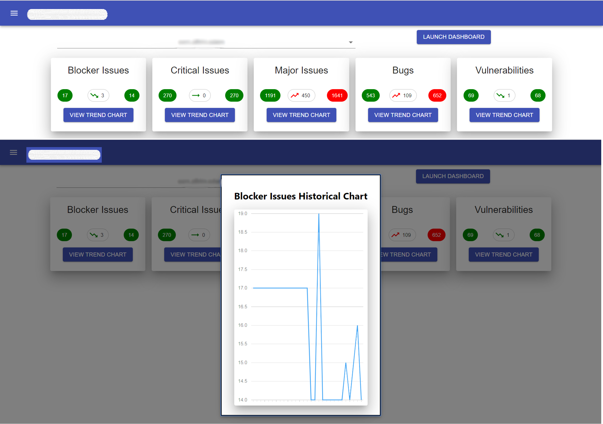
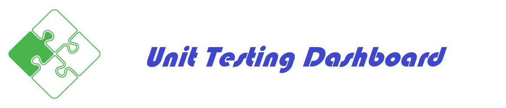
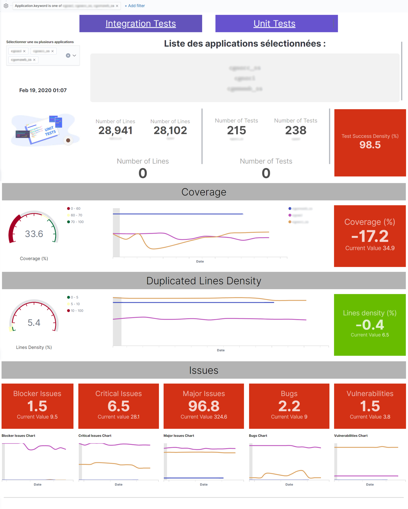
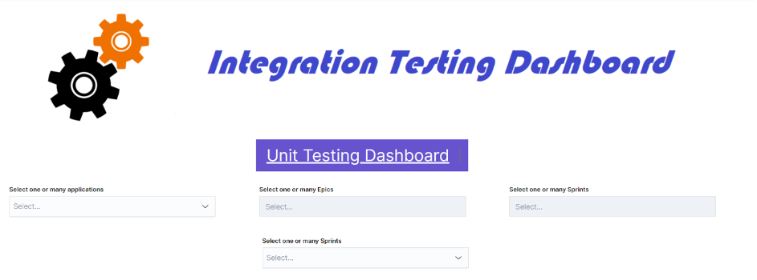
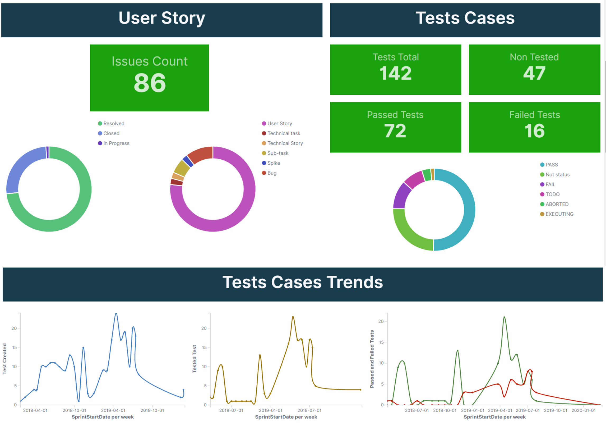
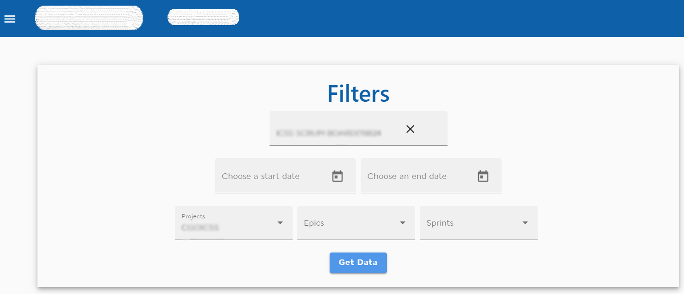
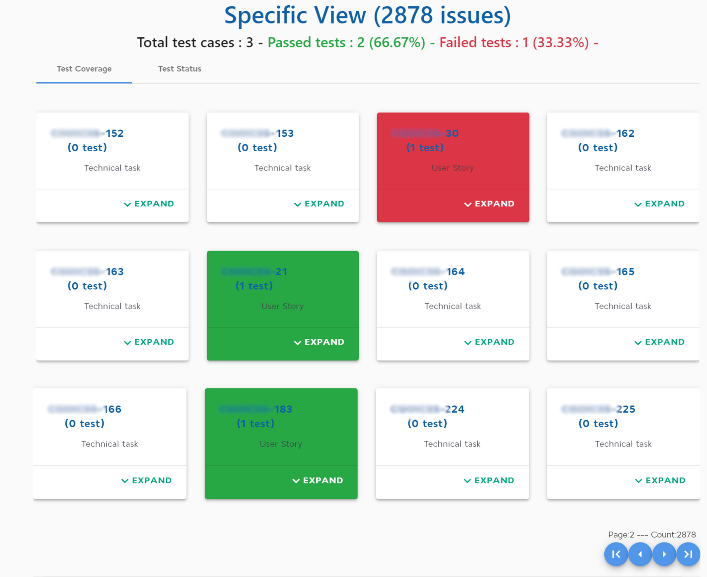

# Projects screenshots

## 1. Dashboard of unit tests metrics by React JS

> Technologies & Tools
>
> - React JS
> - TypeScript
> - API consumers (SonarQube)
> - Bootstrap 4
> - FontAwesome
> - Material UI
> - dx-react-chart-material-ui

***

## 2. Dashboard of unit tests metrics by ELK

> Technologies & Tools
>
> - ElasticSearch 7
> - Logstash 7 (http_poller)
> - Kibana 7
> - API consumers (SonarQube)

***

## 3. Dashboard of integration tests metrics by ELK

> Technologies & Tools
>
> - ElasticSearch 7
> - Logstash 7 (http_poller)
> - Kibana 7
> - API consumers (SonarQube, JIRA, Xray)

***

## 4. Dashboard of integration tests metrics by Angular 8

> Technologies & Tools
>
> - Angular 8
> - TypeScript
> - API consumers (SonarQube, JIRA, Xray)
> - Bootstrap 4
> - Angular Material

***
